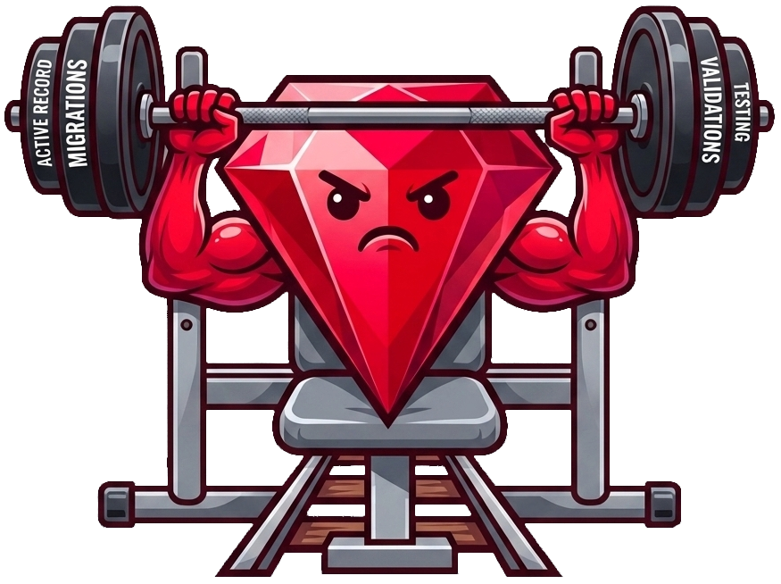

# 

# Rails Gym


---

A local, open-source platform for practicing real Rails skills through
muscle-memory training. Write migrations, models, validations, and
ActiveRecord queries — get instant feedback from real RSpec tests
running inside an isolated Docker sandbox.

```
Read task → Write code → Run tests → See results → Repeat
```

---

## What is Rails Gym?

Most Rails tutorials show you code to read. Rails Gym makes you **write** it.

Every exercise gives you:
- A real Rails file to edit (model, migration, service object)
- A task description with requirements
- A "Run Code" button that executes your code against hidden RSpec tests
- Immediate pass/fail feedback with full RSpec output

---

## Architecture

### Three-layer design

| Layer | Technology | Responsibility |
|-------|-----------|----------------|
| Frontend | React + Vite + Monaco | Editor, UI, display results |
| Backend | Rails 8 API | Orchestrate Docker, store exercises |
| Sandbox | Rails 8 + SQLite + Docker | Run user code safely |

**The backend never executes user code directly.**
All execution happens inside the isolated Docker container.

---

## Prerequisites

Before you start, make sure you have:

- **Ruby** 3.2.2+
- **Rails** 8.0+
- **Node.js** 18+
- **PostgreSQL**
- **Docker**

---

## Quick Start

### 1. Clone the repo

```bash
git clone https://github.com/Bane-999/rails-gym.git
cd rails-gym
```

### 2. Build the Docker sandbox

```bash
cd sandbox
docker build -t rails-gym-sandbox .
cd ..
```

This takes 2-3 minutes the first time. Subsequent builds are fast.

### 3. Set up the backend

```bash
cd server

# Install gems
bundle install

# Configure database (edit if your PostgreSQL credentials differ)
cp .env.example .env

# Create database, run migrations, seed exercises
rails db:create db:migrate db:seed

# Start the server
rails s
```

### 4. Set up the client (React frontend)

Open a new terminal:

```bash
cd client

# Install dependencies
npm install

# Start the dev server
npm run dev
```

### 5. Open the app

Visit **http://localhost:5173** 🎉

---

## Exercises

| # | Title | Category | Difficulty |
|---|-------|----------|------------|
| 001 | Validate Presence of Email | Validation | Easy |
| 002 | Add Age Column Migration | Migration | Easy |
| 003 | ActiveRecord: Find Admins | ActiveRecord | Medium |
| 004 | User has_many Posts | Associations | Medium |

---

## Adding a New Exercise

### 1. Add the spec to the sandbox

```bash
# sandbox/spec/exercises/005_your_exercise_spec.rb
RSpec.describe YourThing, type: :model do
  it "does what the user should implement" do
    # ...
  end
end
```

### 2. Update the schema if needed

```ruby
# sandbox/db/schema.rb
create_table :new_table do |t|
  t.string :name
  t.timestamps
end
```

### 3. Rebuild the Docker image

```bash
cd sandbox
docker build -t rails-gym-sandbox .
```

### 4. Add exercise metadata to server seeds

```ruby
# server/db/seeds.rb
Exercise.create!(
  exercise_id: "005_your_exercise",
  title:       "Your Exercise Title",
  difficulty:  "beginner",
  category:    "validations",
  description: "Short description shown in list view.",
  instructions: <<~MD,
    ## Your Task
    ...
  MD
  starter_code: {
    "app/models/your_model.rb" => <<~RUBY
      class YourModel < ApplicationRecord
        # TODO
      end
    RUBY
  }
)
```

```bash
cd server && rails db:seed
```


---

## How the Sandbox Works

When you click "Run Code":

```
Frontend (React)
     │
     │ POST /api/exercises/run
     │ { exercise_id: "001_user_validation", files: {...} }
     ▼
Backend (Rails API)
     │
     │ CodeRunnerService
     │ writes to tmp/submissions/
     │ docker run --rm -v ... rails-gym-sandbox
     ▼
Sandbox (Docker)
     │
     │ copies user code
     │ loads schema
     │ bundle exec rspec
     ▼
Backend receives output
     │
     │ parses RSpec output
     │ returns { success:, output:, message: }
     ▼
Frontend displays results
```

---

## Security

| Protection | How |
|-----------|-----|
| No internet in container | `--network none` |
| RAM limited | `--memory 256m` |
| CPU limited | `--cpus 0.5` |
| Container auto-removed | `--rm` |
| No persistent state | Fresh SQLite each run |
| Hidden specs | Users never see `spec/exercises/` |


---

## Troubleshooting

**Docker permission denied:**
```bash
sudo usermod -aG docker $USER
# Log out and log back in
```

**Port already in use:**
```bash
# Change port in server (from server folder)
rails server -p 3001

# Update client .env (from client folder)
VITE_API_URL=http://localhost:3001/api
```

**Docker image not found:**
```bash
cd sandbox && docker build -t rails-gym-sandbox .
```

---

## Contributing

1. Fork the repo
2. Create a branch: `git checkout -b feat/new-exercise`
3. Add your exercise following the guide above
4. Make sure backend specs pass: `bundle exec rspec`
5. Open a pull request

Exercise ideas welcome!

---

## License

MIT — see [LICENSE](LICENSE.txt).

---
